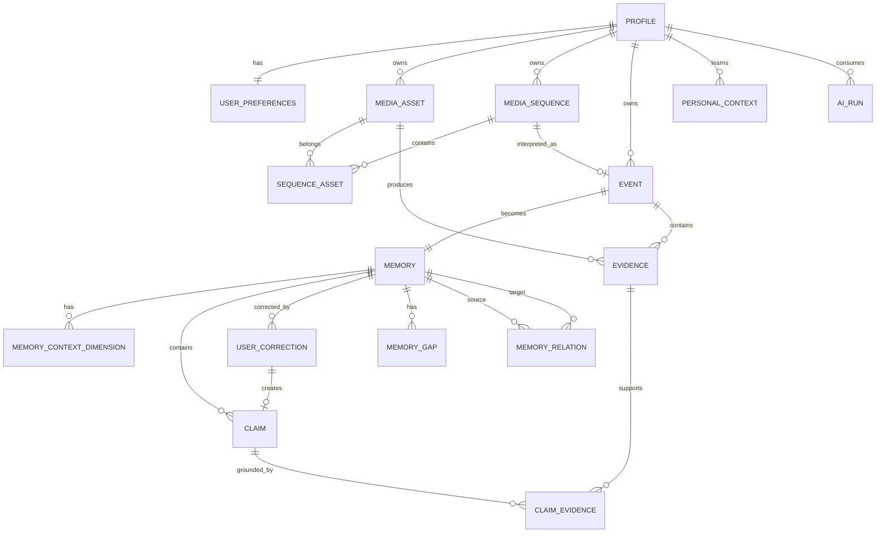

# Re:Memory — Database Design

> AI HACK 2026 MVP
>
> Database: PostgreSQL / Supabase
>
> 方針: relational modelを使用し、MVPではGraph DB / mandatory Vector DBを使用しない。

---

## 1. Database Principles

1. すべてのprivate dataはowner scoped。
2. 可能な限りprivate tableに`user_id`を持たせる。
3. Supabase RLSを必須にする。
4. AI推論・deterministic observation・user confirmedを混ぜない。
5. AI ClaimはEvidenceへ辿れること。
6. User Correctionはappend-onlyを基本とし、元Claimを破壊的上書きしない。
7. exact GPSを通常DB columnへ保持しない。
8. deleted / unsupported / disputed dataを通常Retrievalへ混ぜない。
9. AI cost / model / latencyはcontentを保存せず監査可能にする。
10. Phase 2共有へ拡張可能にするが、MVPでは個人完結。

---

# 2. ER Overview



---

# 3. `profiles`

Supabase `auth.users`に1:1で対応。

```sql
create table public.profiles (
  id uuid primary key references auth.users(id) on delete cascade,
  display_name text,
  avatar_url text,
  created_at timestamptz not null default now(),
  updated_at timestamptz not null default now()
);
```

---

# 4. `user_preferences`

Privacy / AI / confirmation設定。

```sql
create table public.user_preferences (
  user_id uuid primary key references public.profiles(id) on delete cascade,

  use_photos boolean not null default true,
  use_captured_at boolean not null default true,
  use_location boolean not null default false,
  use_calendar boolean not null default false,
  use_people boolean not null default false,

  search_learning_enabled boolean not null default true,

  confirmation_timing text not null default 'on_app_open'
    check (confirmation_timing in (
      'after_event',
      'evening',
      'next_day',
      'on_app_open',
      'off'
    )),

  preferred_confirmation_time time,

  created_at timestamptz not null default now(),
  updated_at timestamptz not null default now()
);
```

---

# 5. `media_assets`

写真 / 動画共通。

MVPではimageを実解析し、videoはmodel対応のみでもよい。

```sql
create table public.media_assets (
  id uuid primary key default gen_random_uuid(),
  user_id uuid not null references public.profiles(id) on delete cascade,

  media_type text not null
    check (media_type in ('image', 'video')),
  mime_type text not null,

  storage_key text not null,
  derivative_storage_key text,

  sha256 text not null,

  bytes bigint not null check (bytes >= 0),
  width integer,
  height integer,
  duration_ms integer,

  captured_at timestamptz,
  timezone_offset text,

  coarse_place text,

  extraction_status text not null default 'pending'
    check (extraction_status in ('pending','processing','complete','failed')),
  analysis_status text not null default 'pending'
    check (analysis_status in ('pending','processing','complete','failed','not_supported')),

  created_at timestamptz not null default now(),
  updated_at timestamptz not null default now(),

  unique(user_id, sha256)
);
```

**作成しない:**

- `exact_lat`
- `exact_lng`
- raw GPSの通常列

exact GPSはoriginal fileのEXIF内に留め、server-side coarse location変換後に通常処理から除外する。

---

# 6. `media_sequences`

Temporal Sequence。

```sql
create table public.media_sequences (
  id uuid primary key default gen_random_uuid(),
  user_id uuid not null references public.profiles(id) on delete cascade,

  started_at timestamptz,
  ended_at timestamptz,
  coarse_place text,

  status text not null default 'provisional'
    check (status in ('provisional','active','deleted')),

  cluster_version text not null default 'v1',

  created_at timestamptz not null default now(),
  updated_at timestamptz not null default now()
);
```

---

# 7. `sequence_assets`

SequenceとAssetのjoin。

```sql
create table public.sequence_assets (
  sequence_id uuid not null references public.media_sequences(id) on delete cascade,
  asset_id uuid not null references public.media_assets(id) on delete cascade,

  position integer not null default 0,
  is_representative boolean not null default false,
  reason text,

  primary key(sequence_id, asset_id)
);
```

必要に応じてactive sequenceへの1 asset多重所属をapplication / constraintで制限する。

---

# 8. `events`

Sequenceを出来事候補へ昇格したもの。

```sql
create table public.events (
  id uuid primary key default gen_random_uuid(),
  user_id uuid not null references public.profiles(id) on delete cascade,
  sequence_id uuid references public.media_sequences(id) on delete set null,

  started_at timestamptz,
  ended_at timestamptz,
  coarse_place text,

  title_candidate text,

  status text not null default 'provisional'
    check (status in ('provisional','active','deleted')),

  created_at timestamptz not null default now(),
  updated_at timestamptz not null default now()
);
```

---

# 9. `evidence`

Re:Memoryの中核。

```sql
create table public.evidence (
  id uuid primary key default gen_random_uuid(),
  user_id uuid not null references public.profiles(id) on delete cascade,

  event_id uuid references public.events(id) on delete cascade,
  asset_id uuid references public.media_assets(id) on delete cascade,

  kind text not null,
  field text not null,
  value_json jsonb not null,

  source_type text not null
    check (source_type in (
      'metadata',
      'ai_observation',
      'user_statement',
      'calendar',
      'location',
      'system'
    )),

  source_version text,
  observed_at timestamptz,

  validity text not null default 'valid'
    check (validity in ('valid','uncertain','invalid','deleted')),

  created_at timestamptz not null default now()
);
```

例:

```json
{
  "kind": "metadata_observation",
  "field": "captured_at",
  "value": "2026-08-12T14:03:00+09:00"
}
```

```json
{
  "kind": "ai_observation",
  "field": "activity",
  "value": "robot adjustment"
}
```

同じ`evidence` tableへ入っていても、`source_type`を必ず区別する。

---

# 10. `memories`

Memory本体。

```sql
create table public.memories (
  id uuid primary key default gen_random_uuid(),
  user_id uuid not null references public.profiles(id) on delete cascade,
  event_id uuid not null unique references public.events(id) on delete cascade,

  title text not null,
  summary text,

  status text not null default 'draft'
    check (status in ('draft','active','disputed','deleting','deleted')),

  importance_band text not null default 'low'
    check (importance_band in ('low','medium','high')),

  importance_reasons jsonb not null default '[]'::jsonb,

  visibility text not null default 'private'
    check (visibility in ('private','shared')),
  share_status text not null default 'none',

  created_at timestamptz not null default now(),
  updated_at timestamptz not null default now()
);
```

MVPでは`visibility='private'`のみ使用。

---

# 11. `memory_context_dimensions`

Context Completenessを独立管理。

```sql
create table public.memory_context_dimensions (
  id uuid primary key default gen_random_uuid(),
  user_id uuid not null references public.profiles(id) on delete cascade,
  memory_id uuid not null references public.memories(id) on delete cascade,

  dimension text not null
    check (dimension in (
      'time',
      'location',
      'activity',
      'purpose',
      'people',
      'result',
      'meaning'
    )),

  status text not null
    check (status in ('known','missing','unknown','not_applicable')),

  active_claim_id uuid,
  importance_weight smallint not null default 1,

  updated_at timestamptz not null default now(),

  unique(memory_id, dimension)
);
```

`active_claim_id` FKはclaims作成後のmigrationで追加してもよい。

---

# 12. `claims`

Memoryについての原子的主張。

```sql
create table public.claims (
  id uuid primary key default gen_random_uuid(),
  user_id uuid not null references public.profiles(id) on delete cascade,
  memory_id uuid not null references public.memories(id) on delete cascade,

  field text not null,
  value_json jsonb not null,

  origin text not null
    check (origin in ('deterministic','ai','user')),

  confidence_band text not null default 'low'
    check (confidence_band in ('low','medium','high','unsupported')),

  confirmation_status text not null default 'unconfirmed'
    check (confirmation_status in ('unconfirmed','user_confirmed','disputed')),

  status text not null default 'generated'
    check (status in (
      'generated',
      'active',
      'superseded',
      'rejected',
      'disputed',
      'unsupported',
      'deleted'
    )),

  created_at timestamptz not null default now(),
  updated_at timestamptz not null default now()
);
```

Important:

- `origin='ai'`を直接`confirmation_status='user_confirmed'`にしない。
- User confirm時はUserCorrection + user-origin Claimを作る。

---

# 13. `claim_evidence`

```sql
create table public.claim_evidence (
  claim_id uuid not null references public.claims(id) on delete cascade,
  evidence_id uuid not null references public.evidence(id) on delete cascade,

  primary key(claim_id, evidence_id)
);
```

AI Claimをactiveにする際、最低1件のEvidence referenceをapplication transactionで強制する。

---

# 14. `user_corrections`

Append-only correction record。

```sql
create table public.user_corrections (
  id uuid primary key default gen_random_uuid(),
  user_id uuid not null references public.profiles(id) on delete cascade,
  memory_id uuid not null references public.memories(id) on delete cascade,

  target_claim_id uuid references public.claims(id) on delete set null,

  action text not null
    check (action in ('confirm','replace','reject','resolve')),

  value_json jsonb,

  created_at timestamptz not null default now()
);
```

Correction flow:

```text
AI Claim
→ superseded / rejected if needed

UserCorrection
→ immutable record

new user-origin Claim
→ active + user_confirmed
```

---

# 15. `memory_gaps`

Memory Gap Detection。

```sql
create table public.memory_gaps (
  id uuid primary key default gen_random_uuid(),
  user_id uuid not null references public.profiles(id) on delete cascade,
  memory_id uuid not null references public.memories(id) on delete cascade,

  dimension text,

  gap_type text not null
    check (gap_type in (
      'purpose',
      'event_type',
      'result',
      'people',
      'context'
    )),

  question text,
  options_json jsonb,

  confidence_band text not null default 'low'
    check (confidence_band in ('low','medium','high')),

  reason_json jsonb not null default '{}'::jsonb,

  status text not null default 'detected'
    check (status in (
      'detected',
      'ready_to_ask',
      'deferred',
      'resolved',
      'skipped',
      'dismissed'
    )),

  asked_count integer not null default 0 check (asked_count >= 0),

  created_at timestamptz not null default now(),
  resolved_at timestamptz
);
```

`options_json`例:

```json
[
  { "label": "FTCの練習", "value": "ftc_practice" },
  { "label": "授業", "value": "class" },
  { "label": "その他", "value": "other" }
]
```

---

# 16. `memory_relations`

Memory ThreadのRelation。

```sql
create table public.memory_relations (
  id uuid primary key default gen_random_uuid(),
  user_id uuid not null references public.profiles(id) on delete cascade,

  source_memory_id uuid not null references public.memories(id) on delete cascade,
  target_memory_id uuid not null references public.memories(id) on delete cascade,

  relation_type text not null,

  origin text not null
    check (origin in ('deterministic','ai','user')),

  confirmation_status text not null default 'unconfirmed'
    check (confirmation_status in ('unconfirmed','user_confirmed','disputed')),

  confidence_band text not null default 'low'
    check (confidence_band in ('low','medium','high')),

  reason_json jsonb not null default '{}'::jsonb,

  created_at timestamptz not null default now(),
  updated_at timestamptz not null default now(),

  check (source_memory_id <> target_memory_id)
);
```

UI mapping:

```text
origin/confirmation = AI/unconfirmed
→ ○ ┈┈┈ ○

user confirmed
→ ● ━━━━━ ●
```

---

# 17. `personal_context`

Personalized Retrieval用。

```sql
create table public.personal_context (
  id uuid primary key default gen_random_uuid(),
  user_id uuid not null references public.profiles(id) on delete cascade,

  context_type text not null,
  key text not null,
  value_json jsonb not null,

  source_type text not null,

  confirmation_status text not null default 'candidate'
    check (confirmation_status in ('candidate','user_confirmed','rejected')),

  usage_count integer not null default 0,

  created_at timestamptz not null default now(),
  updated_at timestamptz not null default now()
);
```

例:

```json
{
  "context_type": "alias",
  "key": "ロボコン",
  "value": "FTC",
  "confirmation_status": "user_confirmed"
}
```

単発のAI推測はここへ自動昇格させない。

---

# 18. `ai_runs`

Cost / Observability。

```sql
create table public.ai_runs (
  id uuid primary key default gen_random_uuid(),
  user_id uuid not null references public.profiles(id) on delete cascade,

  purpose text not null,

  model text not null,
  provider text,

  prompt_version text,
  schema_version text,

  input_assets integer not null default 0,
  prompt_tokens integer,
  completion_tokens integer,

  cost_usd_estimate numeric(12,6),
  latency_ms integer,

  retry_count integer not null default 0,

  status text not null
    check (status in ('success','failed','timeout','rate_limited','invalid_output')),

  created_at timestamptz not null default now()
);
```

Application log / ai_runsへ保存しない:

- raw image
- original filename
- exact GPS
- full user question
- raw answer content
- private signed URL

---

# 19. Phase 2: `memory_participants`

MVP migrationへ入れなくてもよい。

将来Shared Memory用。

```sql
create table public.memory_participants (
  memory_id uuid not null references public.memories(id) on delete cascade,
  user_id uuid not null references public.profiles(id) on delete cascade,

  role text not null,
  permission text not null,

  created_at timestamptz not null default now(),

  primary key(memory_id, user_id)
);
```

MVPでは共有UIを実装しない。

---

# 20. Recommended Indexes

```sql
create index idx_assets_user_captured
  on public.media_assets(user_id, captured_at desc);

create unique index idx_assets_user_hash
  on public.media_assets(user_id, sha256);

create index idx_sequences_user_started
  on public.media_sequences(user_id, started_at desc);

create index idx_events_user_started
  on public.events(user_id, started_at desc);

create index idx_memories_user_updated
  on public.memories(user_id, updated_at desc);

create index idx_memories_user_status
  on public.memories(user_id, status);

create index idx_claims_memory_status
  on public.claims(memory_id, status);

create index idx_claims_user_field
  on public.claims(user_id, field);

create index idx_evidence_event
  on public.evidence(event_id);

create index idx_evidence_asset
  on public.evidence(asset_id);

create index idx_memory_gaps_ready
  on public.memory_gaps(user_id, status);

create index idx_relations_source
  on public.memory_relations(source_memory_id);

create index idx_relations_target
  on public.memory_relations(target_memory_id);

create index idx_personal_context_lookup
  on public.personal_context(user_id, context_type, key);

create index idx_ai_runs_user_created
  on public.ai_runs(user_id, created_at desc);
```

---

# 21. RLS

全private tableで有効化する。

最低対象:

- profiles
- user_preferences
- media_assets
- media_sequences
- sequence_assets（親経由またはsecurity definer helper等）
- events
- evidence
- memories
- memory_context_dimensions
- claims
- claim_evidence（親経由）
- user_corrections
- memory_gaps
- memory_relations
- personal_context
- ai_runs

基本policy:

```sql
alter table public.memories enable row level security;

create policy "users read own memories"
on public.memories
for select
using (user_id = auth.uid());

create policy "users insert own memories"
on public.memories
for insert
with check (user_id = auth.uid());

create policy "users update own memories"
on public.memories
for update
using (user_id = auth.uid())
with check (user_id = auth.uid());

create policy "users delete own memories"
on public.memories
for delete
using (user_id = auth.uid());
```

Join tableは単純な`auth.uid()`列がないため、親ownerを確認するpolicy/functionを使う。

**API layerのfilterだけに依存しない。**

---

# 22. Storage Design

Private bucket例:

```text
rememory-private
```

Object path:

```text
{userId}/assets/{assetId}/original
{userId}/assets/{assetId}/vision.webp
```

Flow:

```text
Original
→ validation
→ EXIF extraction
→ resize
→ metadata strip
→ vision.webp
→ external Vision AI
```

Rules:

- bucket public禁止
- user owner prefixで制限
- signed URLは短命
- AIへoriginalを不要に送らない
- logsへsigned URLを残さない

---

# 23. Claim State Transition

```text
AI proposal
    ↓
generated + unconfirmed
    ↓ validator
active + unconfirmed

User confirms
    ↓
UserCorrection(confirm)
    ↓
new user-origin Claim
    ↓
active + user_confirmed

old AI Claim
    ↓
superseded（必要に応じて）
```

Replace:

```text
old claim → superseded
UserCorrection(replace)
new user claim → active
```

Reject:

```text
old claim → rejected
UserCorrection(reject)
```

Conflict:

```text
user-confirmed A
vs
user-confirmed B
→ disputed
→ normal grounded answerでは断定しない
```

---

# 24. Required Invariants

Database / transaction / service layerで守る。

1. `origin='ai'`のactive Claimには最低1件のClaimEvidenceが必要。
2. AI Claimを直接user confirmedへ昇格させない。
3. User Correctionを消してuser-origin Claimのprovenanceを失わせない。
4. correctionでraw Evidenceを上書きしない。
5. User confirmedをAI inferenceより優先。
6. user-confirmed同士の矛盾はdisputed。
7. factual answerはactive Claimへ辿れる。
8. ClaimはEvidenceまたはUserCorrectionへ辿れる。
9. deleted / superseded / rejected / disputed / unsupported Claimは通常回答に使わない。
10. deleted MemoryをTimeline / Retrieval / Chat対象から除外。
11. exact GPSを通常AI input / Analytics /普通のlocation columnへ保存しない。
12. AI outputからauthorization / deleteを実行しない。
13. `Memory Importance`はuserの人生価値を意味しない。
14. Context Completeness 100%を強制しない。

---

# 25. Retrieval Query Model (Application-side)

MVPは専用Vector DBなしで開始可能。

AI Query Parserの出力例:

```ts
interface ParsedMemoryQuery {
  rawQuery: string;
  dateRange?: {
    from?: string;
    to?: string;
  };
  places?: string[];
  people?: string[];
  activities?: string[];
  keywords?: string[];
  aliasesApplied?: Array<{
    from: string;
    to: string;
    source: "user_confirmed" | "session";
  }>;
}
```

Flow:

```text
parse
→ SQL structured candidate filter
→ small candidate set
→ semantic/AI rerank
→ confidence gate
```

Candidateが拮抗した場合、上位2〜3件を返す。

---

# 26. AI Cost Gate

3,000円前後のcredit制約を想定する。

実装では固定残高をhard-codeせず、設定可能にする。

記録対象:

- purpose
- model
- provider
- token count
- image count
- latency
- retry
- estimated cost
- status

Cost cap到達時:

- 新規AI解析をfail closed
- 既存Memory閲覧は可能
- UIで理由を表示

---

# 27. Deletion / Forgetting

Product上の見せ方はまだ保留。

ただしSecurity / data ownershipとして最低限、内部的には削除できる設計が必要。

MVP UIで削除を主役にしない。

最低要件:

- ownerだけ実行可能
- deleting stateで即Retrieval対象外
- derived dataが残存しないようcascade / transaction
- failure時に成功表示しない

詳細な「Claim単位忘却」等はProduct Decision確定前に勝手に広げない。

---

# 28. Migration Strategy

推奨順:

1. profiles / preferences
2. assets / sequences
3. events / evidence
4. memories
5. claims / claim_evidence / corrections
6. context_dimensions / gaps
7. relations / personal_context
8. ai_runs
9. indexes
10. RLS policies
11. Storage policies

Migration後は必ず:

- fresh database apply
- rollback/recreate確認（可能な範囲）
- RLS integration test
- cross-user access test

を行う。

---

# 29. MVP Completion DB Checks

- [ ] Auth user作成でprofile作成可能
- [ ] User AからUser BのAssetを読めない
- [ ] private originalをpublic URLで読めない
- [ ] duplicate SHAが同一user内で増殖しない
- [ ] SequenceへAssetを追加可能
- [ ] EventへSequenceを関連付けられる
- [ ] Evidenceのsource typeを区別できる
- [ ] draft Memoryを作れる
- [ ] AI Claim + Evidenceを保存できる
- [ ] EvidenceなしAI Claimをactiveにしない
- [ ] UserCorrectionからuser Claimを生成できる
- [ ] Memory Gapをqueueできる
- [ ] Personal Contextのcandidate / confirmedを区別できる
- [ ] deleted Memoryを通常queryから除外できる
- [ ] ai_runsからcost/eventを集計できる
- [ ] exact GPSが通常DBに複製されていない

---

# 30. Open Questions

以下はProduct側の最終判断待ち。

1. Delete / Forget UIをどの程度ユーザーへ見せるか
2. Phase 1におけるPeople / Relationship Memory Gapの優先度
3. ConfirmをBottom Navigationに恒常配置するかHomeへ統合するか
4. Calendar connectorをMVP実装するか、将来Sourceとしてinterfaceのみ用意するか
5. coarse locationの具体的geocoder / granularity

Open Questionを推測で本番仕様として固定しない。
