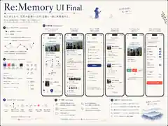
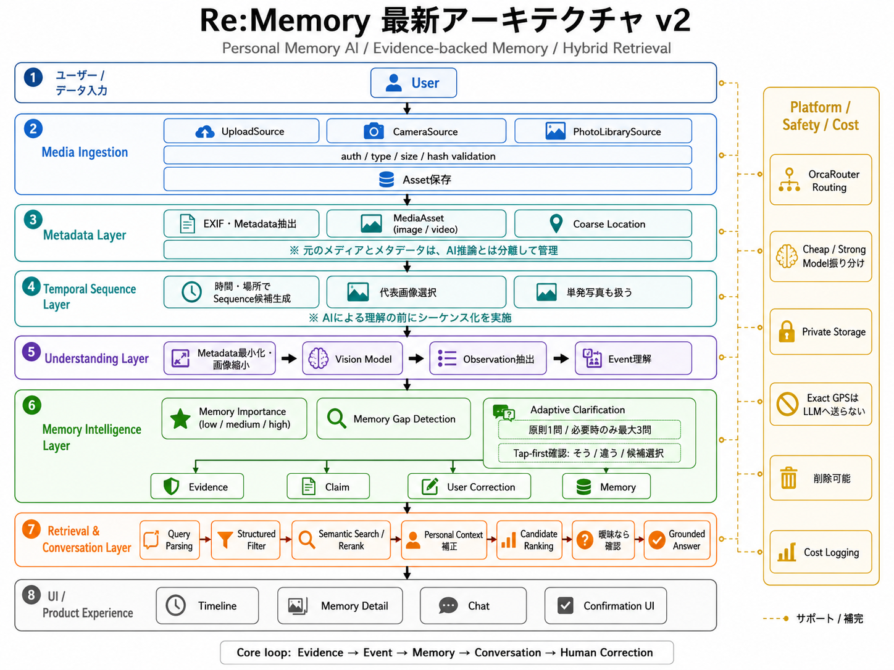

# Re:Memory

> **写真を、記憶に。**  
> AIとユーザーが、散らばった証拠から記憶を一緒につなぎ直す Personal Memory AI.

<p align="center">
  
</p>

---

## Overview

Re:Memory は、単なる写真管理・検索アプリではありません。

写真・撮影日時・場所・予定などの **Evidence（証拠）** をもとに AI が出来事を構造化し、不足している文脈を検出します。AI が分からないことを勝手に確定するのではなく、必要なときだけユーザーへ軽く確認し、その回答を **User Confirmed Memory** として記憶に反映します。

```text
Media
→ Metadata
→ Temporal Sequence
→ Event
→ Evidence
→ AI Inference
→ Memory Gap Detection
→ User Confirmation
→ Memory
→ Search / Recall
```

目指すのは、

> **「写真を探す」のではなく、「あのとき何をしていたか」を思い出せる状態。**

---

## Run Locally

必要なものは Node.js 20.9+、pnpm 11、Supabase project、OpenAI-compatible な
OrcaRouter endpoint です。

```bash
pnpm install
cp .env.example .env.local
pnpm dev
```

別のターミナルで Supabase migration を適用します。local Supabase CLI を使う場合は
Docker が必要です。

```bash
pnpm dlx supabase start
pnpm dlx supabase db reset
```

hosted project へ反映する場合は先に `supabase link` で対象 project を明示してから
`pnpm dlx supabase db push` を実行してください。`.env.local` には少なくとも
Supabase URL/publishable key、`APP_ORIGIN`、AI endpoint/key/model IDs を設定します。
AI を未設定の環境では、架空データへフォールバックせず、復旧可能な設定エラーを表示します。

品質ゲート:

```bash
pnpm verify
pnpm test:e2e
```

主要コマンドと必要な環境変数は [`package.json`](./package.json) と
[`.env.example`](./.env.example) を参照してください。

---

## Problem

スマートフォンには大量の写真が残っていますが、時間が経つと次の情報は失われていきます。

- この写真は何の日だったのか
- 何をしていたのか
- なぜそこにいたのか
- 誰といたのか
- その出来事が何につながったのか

写真自体は残っていても、**写真の背景にある記憶の文脈は残りにくい**という課題があります。

Re:Memory は、その散らばった情報を再構成し、後から自然な言葉で思い出せる状態を作ります。

---

## Product Principles

### Evidence First

AI の事実的な主張は、必ず写真・Metadata・ユーザー回答などの Evidence に紐づけます。

### No Fabricated Memory

AI が根拠のない出来事・目的・感情を事実として作りません。

### Uncertainty is a Feature

分からない場合は、無理に確定せず「未確認」として扱います。

### Human Correction

AI 推定より、ユーザー本人の確認・訂正を優先します。

### Provenance

「なぜそのMemoryになったのか」を後から追跡できる構造にします。

### Privacy First

写真・位置情報・個人情報を必要以上に外部 AI Provider へ送らない設計を採用します。

---

## Signature UX — Memory Thread

Re:Memory のホームは、一般的な写真カード一覧ではなく **Memory Thread** を中心に設計します。

```text
Time
│
● FTC Practice
│ \
│  ├─ Person
│  ├─ Place
│  └┈ Calendar
│
● Robot Build
│ \
│  └── Related Memory
│
● First Design
```

Visual Grammar:

```text
●   Confirmed / Evidence
○   AI Inference
━━  Confirmed Relation
┈┈  AI Inferred Relation
```

AI が推定した関係は点線、ユーザーが確認すると実線へ変化します。

> **曖昧な点が AI によってつながり、人間の確認によって一本の記憶になる。**

---

## Hero Flow

AI HACK 2026 MVP では、以下の一連の体験を最優先で完成させます。

1. 写真をアップロード
2. EXIF / Metadata を抽出
3. 時間・場所から Temporal Sequence を生成
4. Sequence の代表画像を AI 解析
5. Event / Evidence / Memory Draft を生成
6. Memory Importance と Context Completeness を評価
7. 不足している文脈を Memory Gap として検出
8. 必要な場合のみ確認候補を提示
9. ユーザーが `そう / 違う / あとで` で確認
10. User Confirmed Claim として保存
11. 後から曖昧な自然言語で検索
12. Evidence に基づく Grounded Answer を返す

---

## Architecture

<p align="center">
  
</p>

大まかな処理責務は次の通りです。

```text
Upload / Camera
      ↓
Validation / Hash / Metadata
      ↓
Temporal Sequence
      ↓
AI Analysis
      ↓
Evidence / Claims / Event
      ↓
Memory Engine
      ↓
Memory Gap / Confirmation
      ↓
Hybrid Retrieval / Recall
```

詳細は以下を参照してください。

- [Implementation Handoff](./IMPLEMENTATION_PROMPT.md)
- [Database Design](./DATABASE_DESIGN.md)
- [Design / Architecture Images](./docs/images/README.md)

---

## Data Model

MVP では PostgreSQL / Supabase を前提にした relational model を採用します。

主要 Entity:

```text
profiles
user_preferences

media_assets
media_sequences
sequence_assets

events
evidence
memories
memory_context_dimensions
claims
claim_evidence
user_corrections
memory_gaps
memory_relations
personal_context
ai_runs
```

Graph DB は MVP では使用しません。

AI Claim → Evidence、User Correction → User Claim の provenance を追跡できることを重要視しています。

詳細: [DATABASE_DESIGN.md](./DATABASE_DESIGN.md)

---

## Search / Recall

Re:Memory の検索は、単純なキーワード検索ではなく **曖昧な人間の記憶を検索可能な構造へ変換する**ことを目指します。

例:

```text
「去年の春にみんなでロボットを作ってた時」
```

AI Interpretation:

```text
時期: 2025年3月〜5月
人物: チームメンバー
内容: ロボット
活動: 制作 / 練習
```

Retrieval:

```text
Structured Search
+ Semantic Interpretation
+ Personal Context
+ AI Reranking
```

候補が一意に決まらない場合は、AI が勝手に決め打ちせず 2〜3 件を提示します。

---

## Memory Gap Detection

Re:Memory の中核機能の1つです。

Memory Gap は、

> **未来にそのMemoryを理解するために価値があるが、現在のEvidenceでは不足しているContext**

として扱います。

質問は何でも出すのではなく、次の条件を満たした場合だけ提示します。

```text
Memory Importance が十分
AND
Memory Gap が存在
AND
候補を十分絞れている
```

質問 UX は Tap-first。

- そう
- 違う
- 候補選択
- あとで
- Skip

自由記述を強制しません。

---

## UI / Brand Direction

UI は **普遍的な操作性 × Re:Memory 固有の Memory 構造** を目指します。

Design Direction:

- Warm White / Ivory
- Indigo
- Coral
- Sage
- Serif Display
- Sans-serif Body
- Photography
- Thin Border
- Minimal Shadow

Avoid:

- SaaS Dashboard 化
- Gradient の乱用
- Glassmorphism の乱用
- 全要素 Card 化
- Sparkle = AI への依存
- 複雑な Network Graph の常時表示

### UI References

- [UI Final](./docs/images/ui/ui-final.webp)
- [UI ver.01](./docs/images/ui/ui-ver01.webp)
- [UI ver.02](./docs/images/ui/ui-ver02.webp)
- [UI ver.03](./docs/images/ui/ui-ver03.webp)
- [UI ver.04](./docs/images/ui/ui-ver04.webp)

---

## Privacy / Security

Re:Memory は個人的な写真・位置・行動履歴を扱うため、Security / Privacy をプロダクト要件として扱います。

主な方針:

- Supabase RLS による user isolation
- Private Storage
- AI API key は server-side only
- exact GPS を通常 DB / Analytics / AI input に保存しない
- AI Provider には metadata-stripped derivative を送る
- Upload validation / MIME / magic bytes / size limit
- AI output schema validation
- Prompt Injection 対策
- Signed URL の短命化
- AI cost / rate limit

AI に「このデータへアクセスする権限があるか」を判断させません。

---

## MVP Scope

### In Scope

- Auth / private workspace
- Image upload
- Metadata / EXIF extraction
- Temporal Sequence
- AI image analysis
- Evidence / Claim
- Event / Memory
- Context Completeness
- Memory Importance
- Memory Gap Detection
- Non-blocking Confirmation Flow
- Natural Language Search
- Query Interpretation
- Candidate Selection
- Grounded Answer
- Memory Thread UI
- Memory Detail
- Privacy & AI Settings
- Loading / Empty / Error states
- Smartphone-first responsive UI

### Out of Scope for MVP

- Full camera roll automatic sync
- Background photo sync
- Video AI analysis
- Push Notification infrastructure
- Shared Memory UI / SNS
- Friends / Follow
- Face Recognition
- Complex Memory Graph
- Graph DB
- Mandatory Vector DB
- Payment
- Native iOS / Android
- Advanced cross-event reasoning

---

## Implemented Tech Stack

| Layer      | Implementation                                            |
| ---------- | --------------------------------------------------------- |
| Frontend   | Next.js 16 App Router + React 19                          |
| Language   | strict TypeScript 5                                       |
| Styling    | Semantic CSS tokens / responsive editorial UI             |
| Backend    | Next.js Route Handlers / server-only services             |
| Database   | Supabase PostgreSQL migration + RLS + transactional RPCs  |
| Auth       | Supabase Auth cookie session                              |
| Storage    | Supabase private Storage + short-lived signed derivatives |
| AI Gateway | Typed OrcaRouter-compatible adapter with Zod output gates |
| Validation | Zod + magic-byte/decode/image-dimension checks            |
| Test       | Vitest + Playwright + pgTAP policy/invariant tests        |
| Hosting    | Vercel configuration + GitHub Actions CI                  |

---

## Repository Docs

```text
.
├── README.md
├── IMPLEMENTATION_PROMPT.md
├── DATABASE_DESIGN.md
└── docs/
    └── images/
        ├── README.md
        ├── architecture/
        │   ├── architecture-v1.png
        │   └── architecture-v2.png
        └── ui/
            ├── ui-ver01.webp
            ├── ui-ver02.webp
            ├── ui-ver03.webp
            ├── ui-ver04.webp
            └── ui-final.webp
```

### Source of Truth

- Product / implementation requirements → [`IMPLEMENTATION_PROMPT.md`](./IMPLEMENTATION_PROMPT.md)
- Database / RLS / Storage → [`DATABASE_DESIGN.md`](./DATABASE_DESIGN.md)
- UI / Architecture reference → [`docs/images/`](./docs/images/)

画像と仕様が矛盾する場合、**実装仕様とデータ設計を優先**してください。

---

## Development Order

```text
1. Repository inspection
2. Database / Auth / RLS / Storage
3. Media upload / Metadata
4. Temporal Sequence
5. AI Adapter / Evidence / Claim
6. Memory Engine
7. Memory Gap / Confirmation
8. Hybrid Retrieval / Search
9. Memory Thread / Detail UI
10. Privacy / Error states / Accessibility
11. Tests / Security / Cost review
```

Hero Flow が壊れた状態で Optional Feature へ進まないでください。

---

## Open Product Questions

以下はまだ最終決定していません。

- Delete / Forget UX をどこまでユーザーへ見せるか
- Phase 1 で People / Relationship をどの程度 Memory Gap の優先項目にするか
- Confirm を恒常的な Bottom Navigation に置くか、Home Entry Point に統合するか

独断で Product の中心仕様へ変更せず、チームで判断してください。

---

## Current Status

現在は **AI HACK 2026 MVP の実装済み baseline** です。

- Auth、private workspace、画像 upload、EXIF正規化、sequence clustering
- metadata-stripped derivative、server-only AI解析、Evidence/Claim provenance
- Context Completeness / Memory Gap / atomic user correction
- structured retrieval、AI rerank、Grounded Answer、ambiguity/unknown gate
- Memory Thread、詳細、確認、検索、Privacy & AI、完全削除UX
- RLS/private Storage、rate/cost gate、same-origin checks、CSP/security headers
- unit/integration/E2E、responsive/error/empty/partial-state validation、CI

production data path に demo/fake backend はありません。E2Eだけが許可された外部境界 fixture を使います。
UI 画像は引き続き design reference で、実際の画面はユーザー自身のデータまたは正直な空状態を表示します。

---

## AI HACK 2026

Re:Memory is being developed for **AI HACK 2026**.

テーマに対して、単に「AIを使った写真アプリ」を作るのではなく、

> **AIが知らないことを知らないと言い、人間との確認によって記憶を完成させる**

という Human-in-the-loop の Personal Memory System を目指しています。

---

<p align="center">
  <strong>Re:Memory</strong><br />
  思い出は、つながるほど鮮やかになる。
</p>
