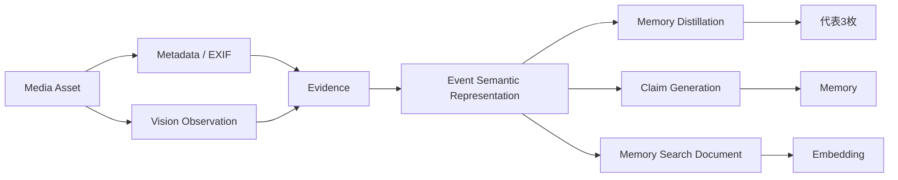
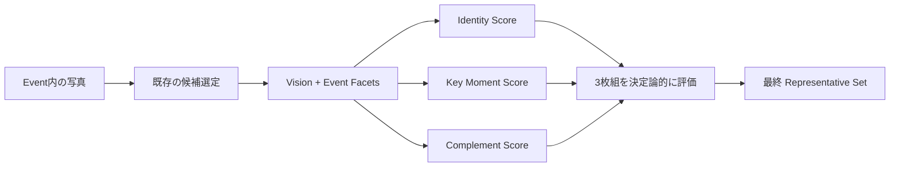
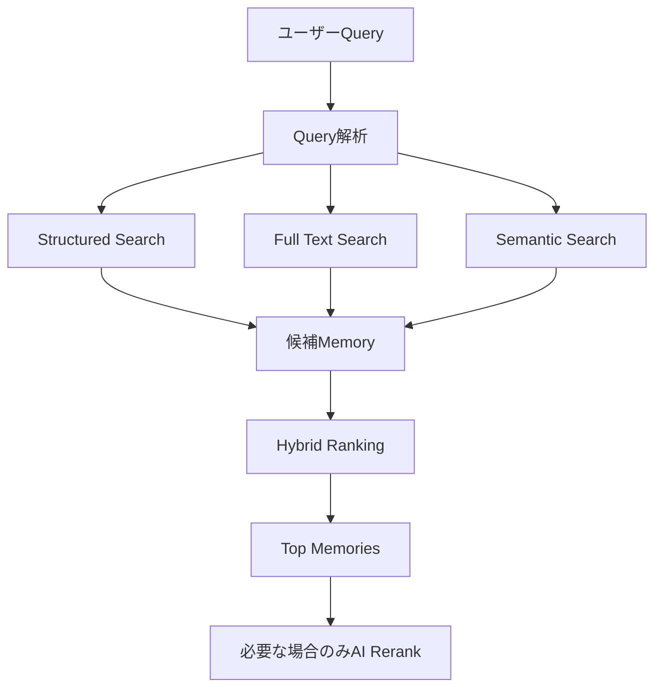
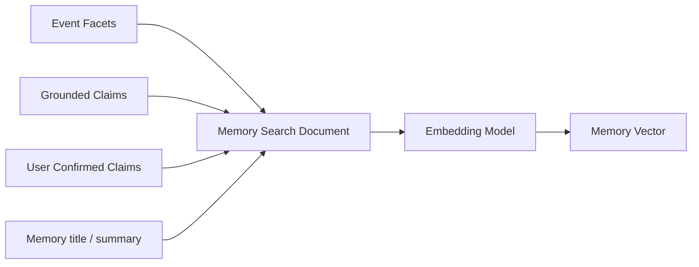
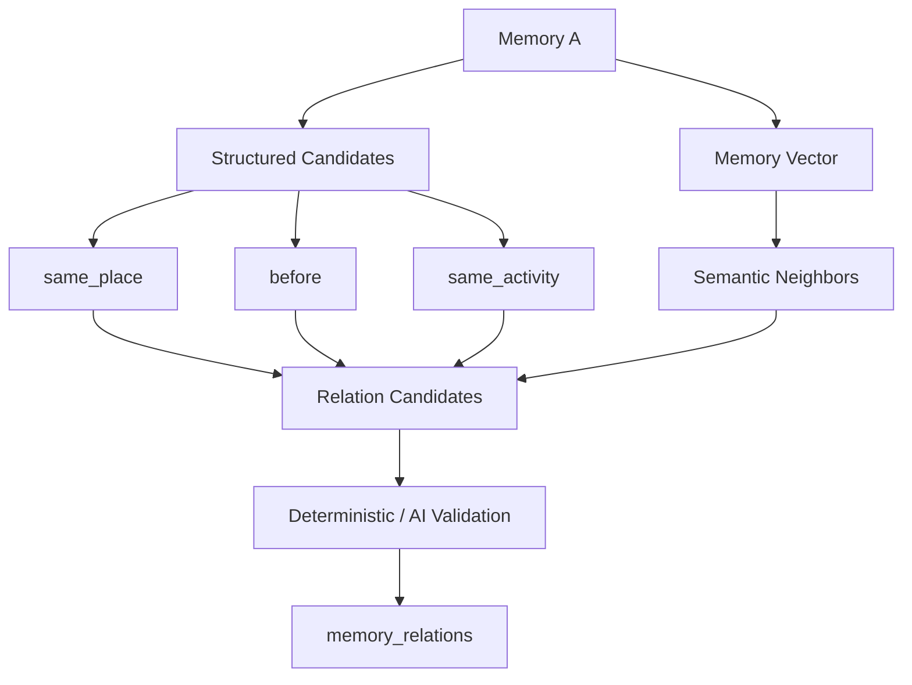
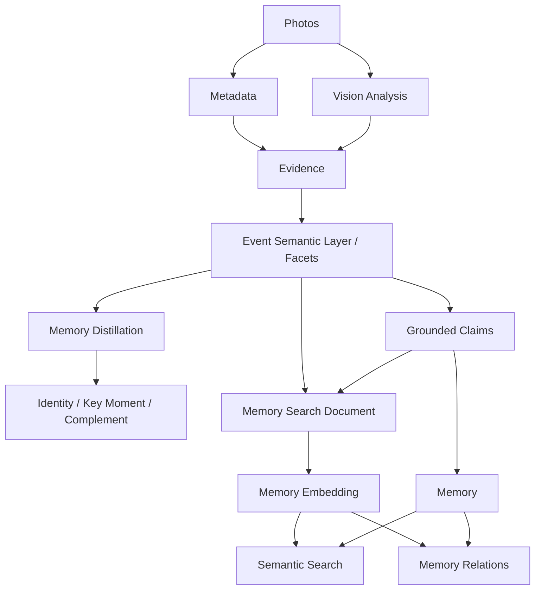

# Event Semantics / Memory Search 設計

## 目的

Memory Distillation と Memory Relations を実装する前提として、次の2点を固定する。

1. Eventを「意味要素」に分解する処理をどのレイヤーに置くか
2. 構造化検索・全文検索・ベクトル検索をどう分担するか

結論は以下。

> **Eventの意味分解は `Evidence → Claim` の間に置く Event Semantic Representation Layer とする。**
>
> **検索は Structured Search + Full Text Search + Memory単位の Semantic Search を組み合わせる。**
>
> **写真1枚ごとのEmbeddingはMVPでは作らない。**

---

## 1. Event Semantic Representation Layer

### 配置



Event Semantic Representation は Claim ではない。

ここでは、写真群から確認できる意味要素を中間表現として構造化する。

例:

- activity: robot adjustment
- object: robot
- people_group: multiple people working
- environment: indoor workspace
- moment: test run
- detail: source code on laptop
- visible_text: image内で確認できる文字

### この位置に置く理由

#### Evidenceより後

意味要素は、画像やMetadataという根拠から導かれるため。

#### Claimより前

`FTC practice` や人物関係、目的などの「人生上の意味」を、画像だけから確定させないため。

#### DistillationとSearchで共有

同じ意味表現を、

- 代表写真選択
- Claim生成
- Semantic Search
- Memory Relations

で再利用できるため。

---

## 2. 実装レイヤー

論理的には1つの機能だが、責務は3層に分ける。

| レイヤー               | 責務                                      |
| ---------------------- | ----------------------------------------- |
| `src/domain/`          | Facet型、検証、Distillationの決定ロジック |
| `src/server/ai/`       | 写真からFacetを抽出するAI契約             |
| `src/server/services/` | AI結果の保存とMemory構築への接続          |

想定:

```text
src/domain/event-semantics.ts
src/domain/memory-distillation.ts
src/server/ai/schemas.ts
src/server/ai/provider.ts
src/server/services/memory-construction.ts
```

基本方針:

> **AIは意味を読む。コードは選ぶ。**

AIに最終的な代表3枚を自由選択させるのではなく、AIは各写真の意味要素を構造化し、Domain側で決定論的に選ぶ。

---

## 3. AI Call数は増やさない

現在の `analyzeSequence()` は、代表候補画像をVisionへ渡し、Observation・title候補・summary候補・activity候補を返している。

この既存Callを拡張して `eventFacets` と各AssetのFacet対応を返す。

例:

```json
{
  "eventFacets": [
    {
      "id": "f1",
      "type": "object",
      "label": "robot",
      "importance": 0.95,
      "assetIds": ["a1", "a2", "a4"]
    },
    {
      "id": "f2",
      "type": "activity",
      "label": "adjusting robot",
      "importance": 0.9,
      "assetIds": ["a2"]
    }
  ]
}
```

追加するのは主に構造化JSONの出力量であり、Vision API呼び出し回数は増やさない。

---

## 4. Memory Distillationへの利用

Event Facetと各写真の対応から、写真ごとの役割適合度を計算する。

### Identity

「何の日だったか」を最も一目で理解できる写真。

評価軸:

- Event Facet Coverage
- Context Coverage
- Quality
- Uniqueness

### Key Moment

「何をしていたか」を最も表す写真。

評価軸:

- Action
- Event Relevance
- Moment Salience
- Quality
- IdentityとのRedundancyを減点

### Complement

Identity + Key Momentに存在しない情報を最も追加する写真。

評価軸:

- Marginal Information Gain
- Temporal Diversity
- Detail Value
- Quality
- Redundancyを減点



重要:

> Representative Set は表示・想起用の3枚であり、Evidence Setの代替ではない。

---

## 5. 検索方式

検索は1方式に統一しない。



### Structured Search

対象:

- captured_at
- year / month
- coarse_place
- memory status
- activity
- user-confirmed purpose
- people
- relation
- truth state

理由:

日時・場所・状態などは意味類似ではなく、確定的な条件として絞り込む方が精度・説明可能性ともに高い。

### Full Text Search

対象:

- 固有名詞
- 略称
- Exact Matchに強い語

例:

- FTC
- Kamiyama
- FIRST
- robot
- competition

PostgreSQL `tsvector` を利用する。

### Semantic Search

対象は写真ではなく **Memory単位**。

1 Memoryにつき1 Search Documentを作り、そのDocumentをEmbeddingする。

---

## 6. Memory Search Document

Embedding対象は以下を正規化して生成する。



含める:

- title
- summary
- activity facets
- object facets
- environment facets
- important moment facets
- active grounded claims
- user-confirmed context

含めない:

- exact GPS
- raw EXIF
- userId
- assetId
- deleted Claim
- disputed Claim
- unsupported Claim
- low-confidence unsupported inference

---

## 7. DB案

MVPでは1 Memory = 1 Vectorとする。

```text
memory_embeddings
-----------------
memory_id
model
dimensions
content_hash
embedding
updated_at
```

`content_hash` により、Search Documentが変わっていない場合は再Embeddingしない。

Embedding再生成タイミング:

- Memory作成完了時
- User Correction後
- Grounded Claim更新時

毎回写真を再解析しない。

---

## 8. 写真EmbeddingをMVPで作らない理由

`asset_visual_embedding` は現Phaseでは導入しない。

理由:

1. Distillation対象は既に4〜6枚程度の小さな候補集合であり、Vector Searchが不要
2. burst / duplicateはHash・時間情報・既存選定ロジックで処理可能
3. Re:Memoryの検索単位はPhotoよりMemoryの方がプロダクト本質に合う
4. 全写真Embeddingは保存量・同期・再生成・モデル移行コストを増やす
5. Semantic Search / Relations / Recall TriggerはMemory Vectorを共用できる

将来、画像そのものから類似場面を検索する要件が発生した場合にのみVisual Embeddingを追加する。

---

## 9. Memory Relationsへの再利用

Memory VectorはSearchだけでなく、Relation候補生成にも使う。



優先順位:

1. Deterministic relation
2. Structured candidate generation
3. Semantic neighbor candidate
4. 必要な場合だけAI validation

AIに全Memoryを総当たり比較させない。

---

## 10. コスト設計

### Event Semantic Representation

追加Vision Call: **0回**

既存 `analyzeSequence()` のStructured Outputを拡張する。

### Embedding

EmbeddingはMemoryのSearch Documentのみ。

生成頻度もMemory作成・Grounded情報更新時に限定する。

したがって、写真枚数に比例してEmbeddingコストが増える設計にはしない。

---

## 11. 最終Architecture



---

## 決定事項

1. **Event意味分解は Evidence と Claim の間に置く。**
2. **既存Vision Callを拡張し、追加Vision Callを作らない。**
3. **AIはEvent Facetを構造化し、代表3枚の最終選択はDomain Logicで行う。**
4. **DistillationではVector Searchを使わない。**
5. **検索は Structured + Full Text + Semantic のHybrid。**
6. **Embeddingは1 Memory = 1 Vector。**
7. **写真単位EmbeddingはMVPでは導入しない。**
8. **Memory VectorをSearch・Relations・将来のRecall Triggerで共用する。**

この設計により、AIコストを抑えながら、説明可能性・検索精度・将来の拡張性を同時に維持する。
