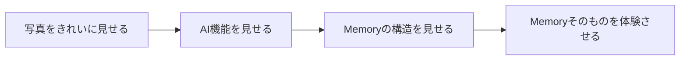
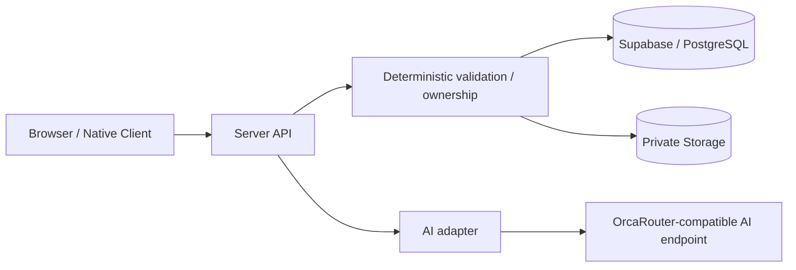
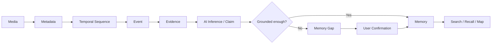
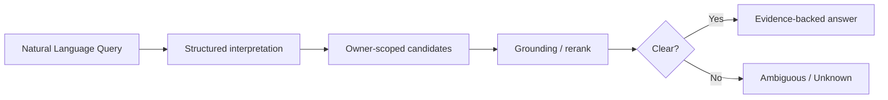
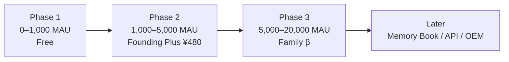

# Qiita Finalization Notes — 2026-08-16

This file records the latest editorial decisions made after PR #100 so the final article can be updated without losing the newer product / business / UI work.

## Final article direction

Working title direction:

> 写真は残る。でも文脈は消える。AIに「記憶」を作らせないPersonal Memory AI「Re:Memory」を作った

The article should explain Re:Memory as a Personal Memory system, not a photo-search demo.

## Image policy

Use only two major explanatory images in the Qiita body:

1. UI: target concept vs actual implementation
2. System Architecture

Everything else should be explained with text, tables, and Mermaid.

Reason:

- easier to update late in the submission
- avoids inconsistent AI-generated visual assets
- lets judges inspect actual technical reasoning instead of decorative diagrams
- the two images are reserved for topics where a visual materially improves understanding

## UI section: what should be explained

The UI story should not be “we made a concept and copied it.”

Explain the design evolution:



Important points:

- early concept was photo-first
- risk: looked like a different photo-management app
- Memory Thread became the central metaphor
- AI inference and confirmed facts use different visual grammar
- final MVP simplified the concept art but preserved the important semantics

Visual grammar:

```text
● Evidence / User Confirmed
○ AI Inference

━━ Confirmed Relation
┈┈ AI Inferred Relation
```

Implementation emphasis:

- Memory first
- AI / Evidence secondary
- lightweight confirmation: そう / 違う / あとで
- provenance can be inspected
- failure / partial / unknown states are explicit

## Architecture section

Architecture should show:



Key claim:

> LLM is not the authority for permissions, database ownership, deletion, or final truth state.

## Core Memory flow



## Memory Gap

Core sentence:

> AIが知らないことは、ユーザーに聞く。

Do not present uncertainty as an error. It is a product feature and truth boundary.

## Durable AI pipeline

Explain why the AI pipeline is checkpointed:

- timeouts happen
- provider errors happen
- retries happen
- Vision can be expensive

A retry after Claim failure should not repeat a completed Vision step.

## Recall

Recall should be described as grounded retrieval, not “chat over all photos.”



## Memory Map

Concept:

> 生きた場所だけ、世界がひらく。

Important clarification:

> Map is Recall by place, not activity tracking.

Use coarse / trusted spatial representation where possible rather than making exact historical GPS the core product state.

## Business model section

Use the current planning model:

| Plan          |            Price | Initial assumption                                 |
| ------------- | ---------------: | -------------------------------------------------- |
| Free          |               ¥0 | ~20–30 photos/month, basic Memory / Recall         |
| Founding Plus |       ¥480/month | ~100 photos/month, Personal AI, richer Recall, Map |
| Family β      | ¥980–1,280/month | opt-in shared Family Memory / Recall               |

Unit economics must be explicitly labeled as assumptions:

```text
Founding Plus revenue       ¥480
AI variable cost target    ~¥120
Infrastructure             ~¥40
Payment fee                ~¥17
Gross profit               ~¥303
Gross margin               ~63%
```

If Free variable cost is ¥30–40/month, one Plus user could theoretically support about 8–10 Free users.

Do not describe these as production measurements.

## Business roadmap



## Family / Personal AI wording

Avoid saying family data is used to retrain the base model.

Use this explanation:

> Confirmed Memory is retrieved only when needed and passed as Personal / Family Context.

Family should be Private Default and explicit-share only.

## Cost wording

Separate:

1. design estimate / target
2. measured production telemetry

Do not put estimated values into a table titled “実測コスト.”

Final production evidence should ideally show:

```text
Vision     $...
Claim      $...
Gap        $...
Recall     $...
----------------
Hero Flow  $...
```

with actual model IDs, token usage, latency, and cost from telemetry.

## Truth Audit before publication

Every final claim should be classified as:

- Implemented
- Validated
- Roadmap

Specific caution:

- Place Picker PR #103 is not merged at the time of this note
- do not claim E2EE / Zero-Knowledge
- do not claim all OrcaRouter capabilities are used by Re:Memory
- do not invent production cost / latency
- do not imply exact GPS can never exist in an original uploaded image; describe the actual AI / application privacy boundary precisely
